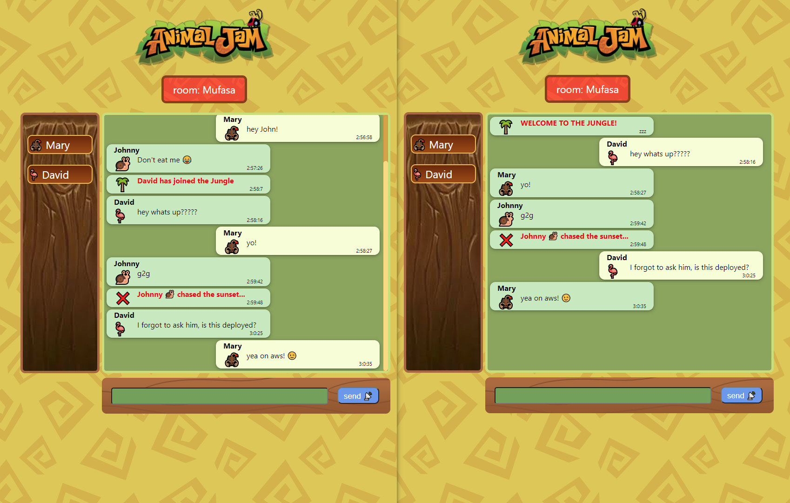

## Fun with animals chatting app
### made with React, Node, Express, Socket-io
#### features
- broadcast client-to-client messages 
- multiple rooms
- show connected users
- notifications when users enter/exit
- bad words filtering
- automatic random emoji assignment to users
- timestamps

how to start the 📂client:
```
$ cd client
$ npm i
$ npm run dev
```

how to start the 📂server:
```
$ cd server
$ npm i
$ nodemon server.js
```


v1.1

#### Disclaimer: AnimalJam(tm) and the AnimalJam logo are owned by WildWorks, Inc.

I have no affiliation with that company, I just used the assets as a theme 😊